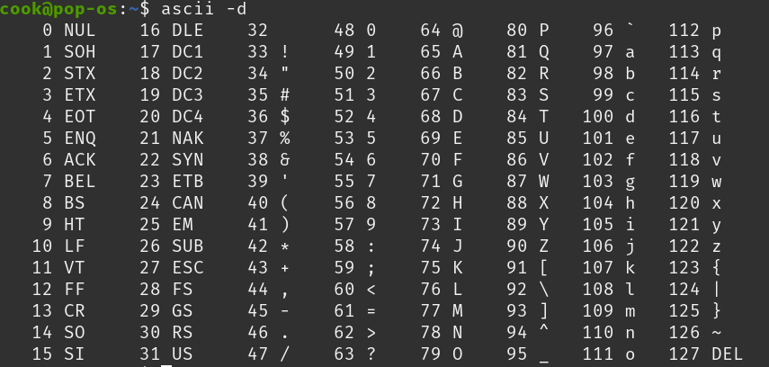
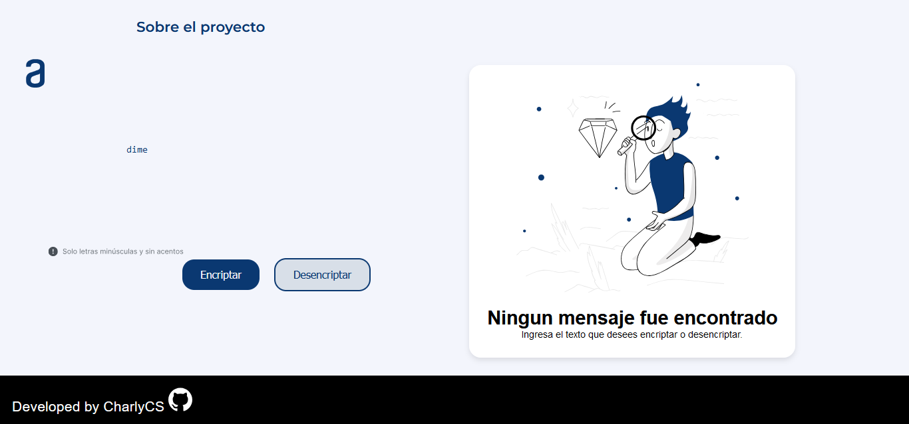
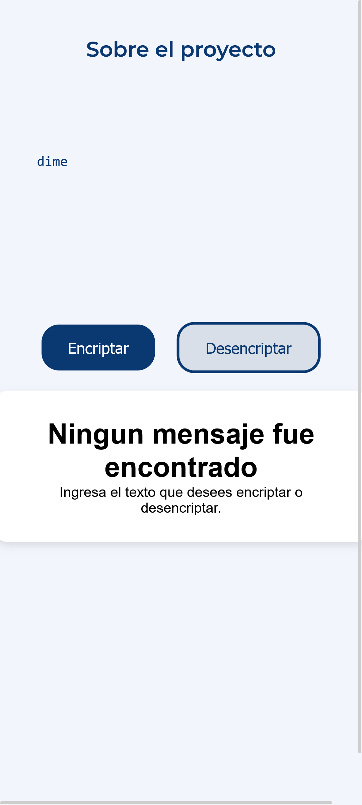

# Text encryption and decryption tool - Oracle ONE Challenge

Este proyecto es una aplicación web para el cifrado y descifrado de texto, desarrollada como parte del Oracle ONE and Alura LATAM Challenge. La aplicación permite a los usuarios cifrar y descifrar un texto de entrada determinado.

This project is a web application for text encryption and decryption, developed as part of the Oracle ONE and Alura LATAM Challenge. The application allows users to encrypt and decrypt a given input text

## Description

The application is designed to encrypt and decrypt text using a basic encryption technique (Caesar Cipher), specifically focusing on lowercase letters using ASCII values from 97 to 122. The encryption logic is implemented without any external libraries, relying solely on JavaScript, HTML, and CSS. The project's focus is on programming logic and creating an interactive user interface.

## Features:

- **Encrypt:** Converts the input text into a ciphered text based on character shifting.
- **Decrypt:** Restores the original text from the ciphered text.

### Initial Screen

## Responsive Design
The application is designed to be responsive, adapting to different screen sizes, from desktops to mobile devices. On smaller screens, elements like the footer and decorative images are hidden to optimize space.

